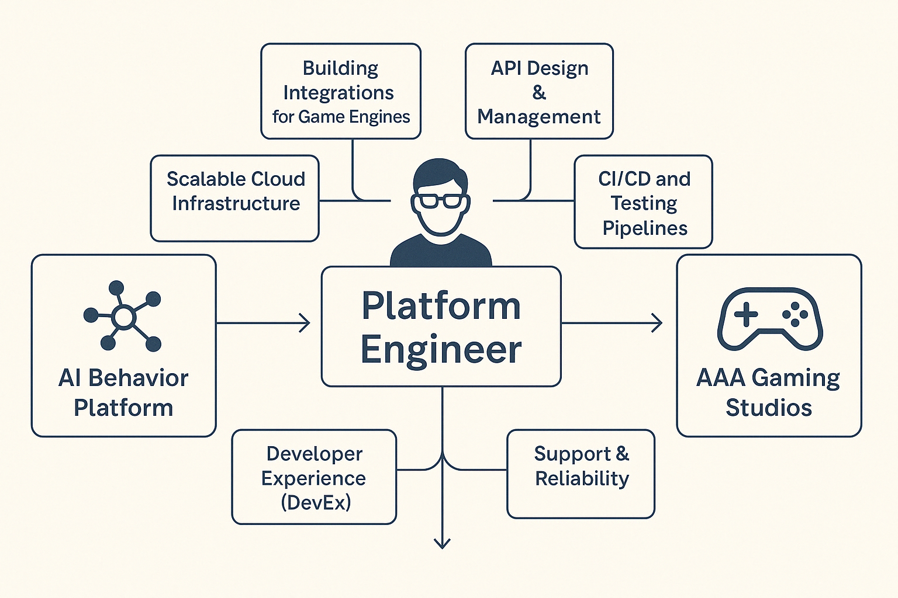

## **Platform as a Product**

Forget short-term projects with fixed deadlines. A platform team is not wrapping up a deliverable, it’s managing a product for life.

Developers are not internal users. They are customers, complete with feedback, feature requests, and opinions about your UI.

That means real product work. Think user research, roadmaps, usability testing, launch planning, and the occasional panic over feedback from your most vocal power user.

### **Devs benefit**

No more waiting on tickets to get a new service spun up. The platform says yes to self-service and goodbye to ops queues.

Developers get guardrails instead of brick walls. Better experience, better productivity, fewer late-night Slack messages about broken staging environments.

It’s not just about shipping faster. It’s about making the whole experience suck less.

### **Infra benefit**

One consistent layer means developers stop consuming cloud like a buffet and start following a menu. That’s great for cost, security, and your own sanity.

Standardization wins here. Instead of reinventing the wheel for every team, infra gets a paved road with guardrails and a map.

Now you can focus on improving infrastructure instead of just explaining it.

### **Execs benefit**

The platform cuts time to market. That means more releases, more features, and yes, more revenue.

Costs go down, velocity goes up, and your engineers are less likely to burn out and quit to open a bakery.

Happy devs are productive devs. And productive devs build things that actually make money.

### **Main focus**

The mission is simple: reduce cognitive load, improve developer experience, and make it easy to do the right thing.

That means partnering with developers, listening to feedback, and obsessing over adoption rates.

You are not just shipping tools. You are curating golden paths that guide teams to success without stepping on landmines.

## **Tasks**

Platform work is equal parts glue and interface.

You are integrating portals, building automations, templating services, managing app configs, and yes, writing CLIs developers might actually enjoy using.

This is the work that makes everything else work. Quietly essential, occasionally heroic, and never quite done.
