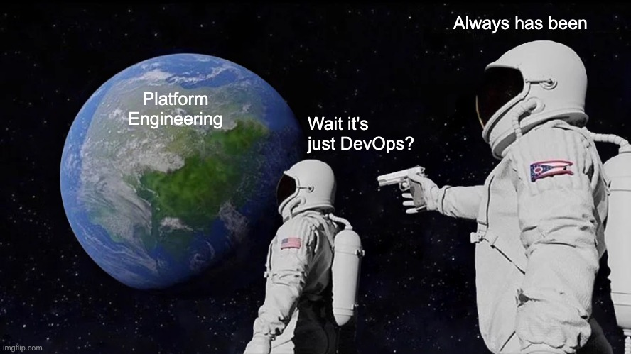

### **The DevOps Pitch (Back in the Day)**

DevOps began with noble intentions:

> “Let’s tear down the wall between Dev and Ops. Let developers own their code in production!”

In theory, this meant faster releases, better reliability, and fewer silos.

Fast releases, shared responsibility, fewer silos—it was a beautiful dream.

Until it wasn’t.

Developers were in production manually editing Nginx. Infra teams were holding Jenkins together with caffeine and curses. YAML files bred like rabbits.

It worked great until everything caught fire at once.

---

### **The Great Wall of Cognitive Load**

Toolchains exploded. One day it was Git and Docker, the next it was service meshes, Vaults, and half a dozen controllers.

Suddenly, everyone was expected to be an infra expert.

Except they weren’t. And they didn’t want to be.

Your frontend dev now had to know why a pod wouldn’t start. Your backend dev was asked to debug a Helm chart from 2019.

Meanwhile, your GitOps controller entered yet another crash loop.

Developers didn’t sign up for this. They just wanted to ship features, not decrypt monitoring dashboards.

> **Reality check:** Developers want to ship features, not debug Helm charts from 2019 written by an intern who’s now doing crypto in Bali.

---

### **The DevOps Burnout Spiral**

DevOps scaled, but the burnout scaled faster.

Each team had their “preferred” tools. Infra was a puzzle of Jenkins jobs, bash scripts, and unspeakable truths.

On-call meant waking up to alerts from systems no one remembered building.

> DevOps said, “You build it, you run it.”  
> But forgot to add, “...and also you own the IAM policies, TLS certs, logging infra, and whatever this Bash script does.”

The end result?  
A lot of tired engineers and a lot of apps held together with hope and retry loops.

---

## **Enter Platform Engineering: The Adults Have Arrived**

Platform engineering stepped in not to kill DevOps, but to rescue it.

> It’s DevOps with guardrails. DevOps with a UX. DevOps without crying in `kubectl`.

Platform engineering didn’t show up to end DevOps. It came to save it from itself.

Think DevOps, but with user experience. DevOps with guardrails. DevOps minus the emotional trauma.

Now there’s a golden path to prod. One toolchain, not 14. Developers deploy with a click. Rollbacks are just as easy.

The platform handles secrets, ingress, TLS, and the scary stuff.

Everything is versioned, documented, and supported like a real product—because it is.

Developers still have freedom. But they’re no longer forced to fight the entire CNCF landscape alone.

> You still get self-service. But now it’s safe, observable, and supported by humans who understand both infrastructure _and_ humans.

---

### **Real-World Examples**

Spotify built Backstage so developers could focus on code, not cloud plumbing. They open-sourced it because they knew everyone else was reinventing the same wheel badly.

At Airbnb, the “Service Framework” means every service comes with logging, compliance, and deploys ready to go.

Shopify treats its internal platforms like products. They run feedback sessions, track usage, and iterate like any serious SaaS team.

These companies didn’t just build platforms. They built trust, velocity, and infrastructure that doesn’t require a support group.

---

### **Critical Take: Why This Matters**

DevOps wasn’t wrong, it just went too far without guardrails.

It imagined developers wanted to be on-call heroes. Most of them just want to ship features without paging the SRE team.

Platform engineering is the reset.

You can still take the hard path. But the easy one now makes sense and actually works.

You can still move fast. But now there’s a system under you designed not to explode.

It’s not about less ownership. It’s about sane ownership.

And maybe, just maybe, fewer YAML nightmares.
