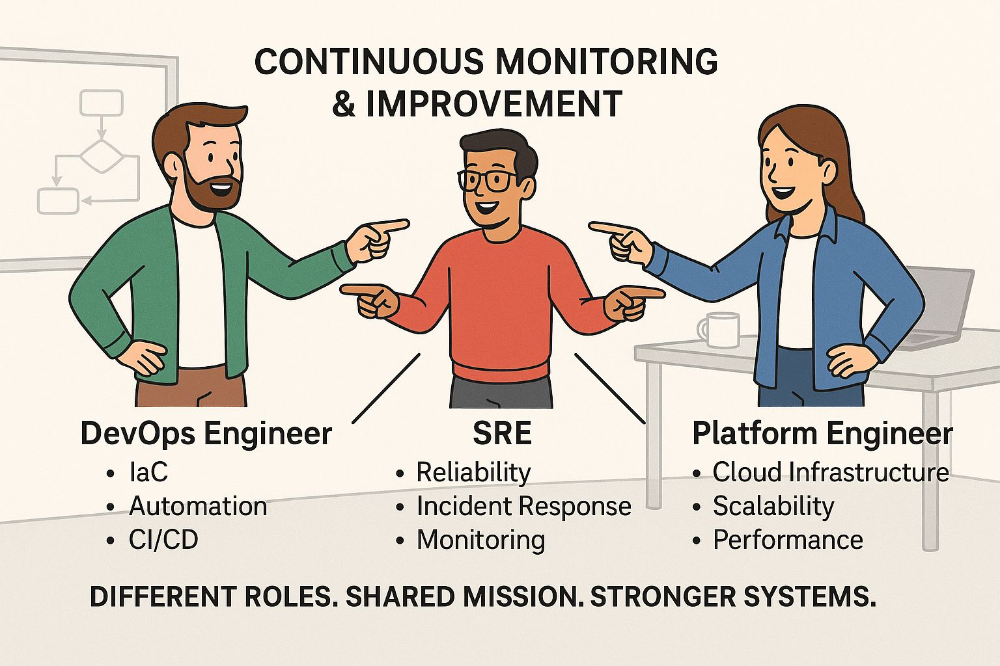

## Everyone’s an Engineer Until Prod Goes Down: Who Does What, Really?

In the intricate mess we call modern software organizations, DevOps, SRE, and Platform Engineering form the holy trinity of not-totally-falling-apart. Each has a purpose. Each has a lane. And every time someone swerves out of theirs, disaster follows. Usually with Slack threads titled “What just happened” and a Zoom call no one wants to be on.

DevOps is the caffeine-fueled engine, churning out pipelines, provisioning clouds with Terraform, and duct-taping CI/CD jobs that only work if the moon is full. Their job is to go fast and not explode. Mostly fast.

SREs, meanwhile, are the firefighters of uptime. They chase down latency spikes like detectives in a noir film and wake up at 3 a.m. because someone thought parsing dates with a regex was a good idea. They carry the weight of reliability while developers YOLO deploy.

Then there are the platform engineers. The quiet infrastructure librarians. They pave the golden paths, abstract the dragons, and desperately try to prevent developers from creating chaos with root access and kubectl.

Together, they keep the machine humming. Separately, they keep therapy in business. A healthy team respects the roles. Because nothing ruins morale faster than a deployment gone rogue in the middle of lunch.

> At Google, SREs own reliability metrics and error budgets, while developers handle deployment with the support of heavily automated tools.[1](https://sre.google/workbook/error-budget-policy/?utm_source=chatgpt.com)

---

## **Friendly Fire: How These Roles Actually Work Together**

If you think these teams work in silos, you’ve already lost. These roles should complement each other like a well-oiled deployment train. DevOps lays the track with pipelines and IaC. SRE checks the safety systems and brakes. Platform Engineering makes sure every train is identical, easy to maintain, and doesn’t need a manual to run.

It only works if there’s communication. When platform teams build golden paths, they need SREs to ensure the paths don’t lead off a cliff. When DevOps teams add a new tool, the platform team has to make it usable at scale. And when SREs see alert fatigue setting in, they need DevOps and Platform Engineering to figure out whether the problem is the code, the infra, or the fact that Prometheus is scraping 6 million endpoints.

> At Airbnb, DevOps practices power the internal tooling, but SREs enforce service reliability standards across product teams. Their platform team acts as the central nervous system—building and maintaining the service framework that ties everything together.[2](https://www.linkedin.com/pulse/platform-engineering-swaminathan-nagarajan/)

---

## **The Spider-Man Meme, but with Titles**

Ask ten engineers what DevOps means and you’ll get ten different answers, one of which is just “someone who knows Jenkins.” The same goes for SRE and Platform Engineering. Misconceptions are everywhere.

People think DevOps means owning everything from code to cloud. Others think SRE is just glorified on-call. And some think Platform Engineering is just writing better Terraform. None of these takes are completely wrong, which is what makes them dangerous.

A common overlap failure is deployment ownership. Everyone wants to design the pipeline, but no one wants to own it when it breaks.

Another trap: multiple teams writing overlapping tooling, unaware they’re solving the same problem in parallel but worse. You end up with four CLI tools that all deploy to staging, but only one supports rollback, and no one remembers which one that is.

> At Shopify, this confusion led to fragmented infrastructure ownership—until they centralized core responsibilities in the platform team and defined clear lines between SRE, DevOps, and developer responsibilities. Suddenly, everyone knew who to bother when the deployment bot exploded.[3](https://logz.io/blog/scaling-platform-engineering-shopify-blueprint/?utm_source=chatgpt.com)

---

## **Org Charts and Other Maps to Chaos**

Where these teams sit in the org often determines their success, or their descent into firefighting obscurity.

DevOps teams embedded in product groups can iterate fast, but without central coordination, they breed entropy.

SREs placed centrally bring consistency, but risk becoming a bottleneck. Platform Engineering works best as a dedicated function, with a clear product mindset and shared vision across the company.

Ownership of lifecycle stages should match proximity to the work.

DevOps might own deployment in a team’s CI/CD.

SRE should own cross-cutting production standards.

Platform Engineering should own the tooling that makes both of those things reusable, secure, and boring in the best way possible.

If responsibilities are vague, incidents turn into live-action blame games, and every runbook ends with "ask #infra."

> X (formally Twitter) historically struggled with this model until they invested heavily in a centralized platform team. That team unified their service deployment model, helped scale safe defaults, and kept the SREs from drowning in unmonitored, misconfigured services.[4](https://mentorcruise.com/blog/why-reliability-starts-with-responsibility/?utm_source=chatgpt.com)
