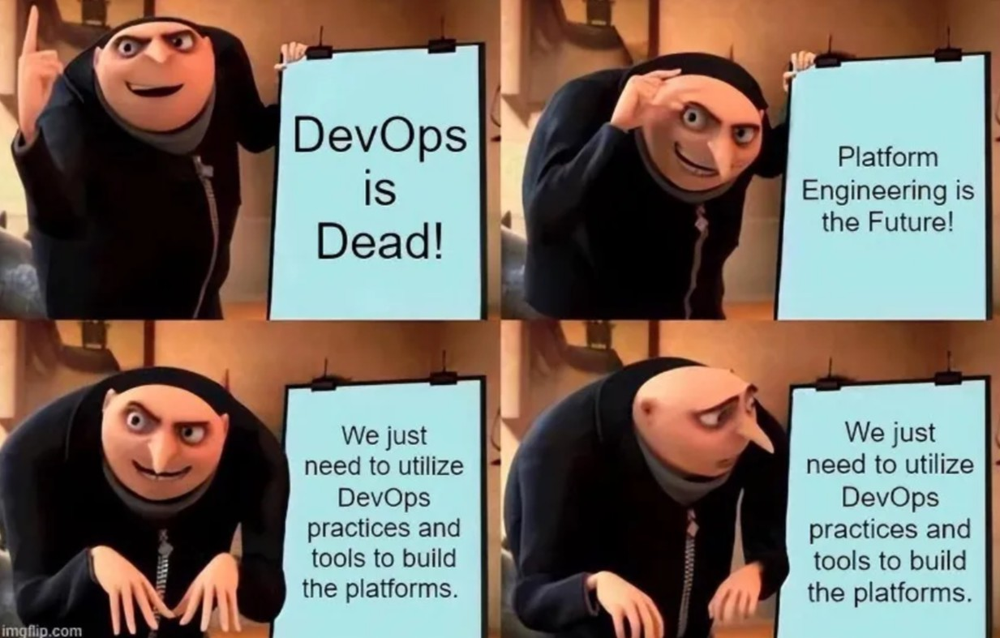

### **First, Learn to Herd the Machines: Kubernetes, Terraform, and CI/CD**

Step one: get fluent in the tools everyone uses but no one truly understands. Kubernetes will test your patience, Terraform will test your Git discipline, and CI/CD will break in the most creative ways on Fridays at 4:59 PM.

You do not have to be a wizard, but you do need to understand the spells. Know how to write a Helm chart that actually works. Know how to stop Terraform from blowing away your production VPC. Know how to make a pipeline that doesn’t require an ops PhD to debug.

These tools are not glamorous. But they’re what makes the magic happen. Your job is to make them invisible. Invisible, but reliable.

---

### **Then Learn to Talk Like a Product Manager and Listen Like a Therapist**

Platform engineering is less “build cool infra” and more “convince people to use it without bribery.” That means product thinking. What does the developer need? Why aren’t they using your beautiful template? Why did they just spin up a random EC2 in `us-east-2`?

It’s your job to build something that solves real problems. Something with just enough buttons, just enough docs, and very few reasons to open a ticket.

And yes, you’ll spend time listening. Not fake listening, but real, active, forehead-wrinkled listening. Because behind every “it’s too slow” is a workflow problem you could solve, if you care enough to ask.

---

### **See the Matrix: Observability and Performance are Table Stakes**

If you ship a platform and forget to observe it, congratulations, you now run a Schrödinger’s System. It’s both working and broken until someone checks.

Good platform engineers live and breathe metrics, logs, and traces. You need to see how things are running, where they’re slow, and why that one service is quietly eating 400% CPU on weekends.

Performance is not about speed for the sake of speed. It’s about making your platform usable under load, stable under stress, and not embarrassing during demos. Especially when a VP is watching.

You are building something that other teams depend on. Observability isn’t optional. It’s your flashlight in the production cave.

---

### **Build It Secure by Default or Prepare for the Audit**

Security in platform engineering is like flossing. No one likes doing it, but if you skip it, things fall out. Literally and figuratively.

You are the infrastructure. That means you are the first and last line of defense. If you make it easy to leak secrets, someone will. If your defaults are wide open, someone will launch an S3 bucket into public view with a smile.

Good security starts with good design. Guardrails, templates, access policies that make sense. Not locked-down nonsense that forces devs to find workarounds. Just solid, secure foundations.

Governance? That’s just what we call it when you build trust at scale. Do it right, and no one complains. Do it wrong, and your platform becomes a cautionary tale on LinkedIn.
