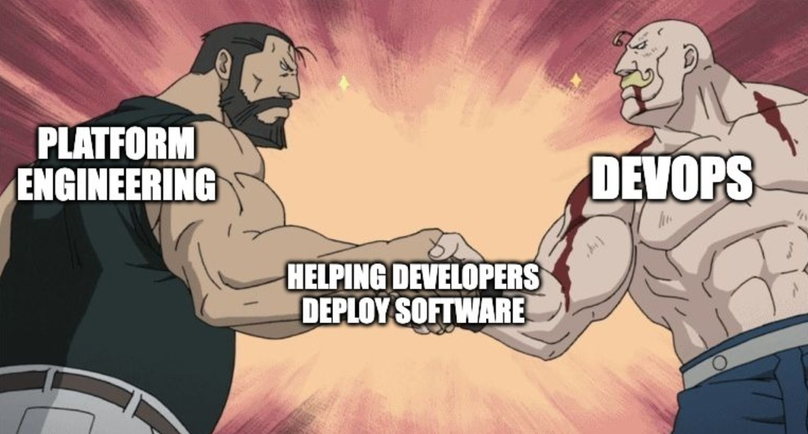

### **Start With the Humans: Understand Dev Workflows Before You Build**

Before you build anything, you need to understand what developers are _actually_ doing, warts and all. Shadow them. Ask where things break. Notice how often they copy-paste Kubernetes YAML and hope for the best. You’re not just mapping workflows, you’re tracing pain.

Then go one level deeper. What cognitive steps are they taking during a deploy? What questions are they asking when debugging? How many tabs are open during an average release? Platform design starts with human experience, and then architecture diagrams.

Because once you truly understand how devs work and how they _really_ work. You can begin to automate the friction away without throwing away the flexibility they secretly love.

---

### **The Building Blocks: What Every Good Platform Needs Inside**

Once you understand the workflows, you can break them into reusable, composable building blocks. Think CI/CD, service scaffolding, secrets management, environment provisioning, audit logs. These aren’t just features, and they’re interfaces between devs and the machine.

But here's the progression: the first version of your platform might just be a handful of scripts and some docs. The next should be a standardized entry point. Eventually, you’re exposing APIs or GUIs with opinionated defaults that reduce decision fatigue. The maturity comes from iteration.

And always keep an eye on dependency risk. A great platform isn’t just usable today, it’s maintainable and extensible six months from now, when no one remembers what that `init.sh` file did.

---

### **Pave the Roads: Why Golden Paths Are Better Than Mandates**

A golden path is not just a happy path. It’s the full developer journey from zero to prod with the guardrails, docs, and integrations baked in. You want that paved road to be fast, smooth, and clearly marked.

But over time, golden paths evolve into internal standards. They aren’t there to enforce; they’re there to inspire confidence. Teams should feel empowered, not boxed in. The trick is to combine product thinking with platform design, treat each path like a user story, with measurable success criteria.

And keep measuring. Adoption is not a one-time win. Your golden path must continuously adapt to shifting tools, org priorities, and the occasional existential crisis about whether to keep using Helm.

---

### **Some Assembly Required: Picking a Tech Stack That Doesn’t Hate You**

Technology should serve your platform strategy, not define it. Your stack should grow from solving _today’s_ pain while keeping future change _possible_. Start with boring, well-documented tools. Avoid the hip new toy unless your team is ready to own it.

In early phases, reuse is king. Leverage open-source projects with strong communities and proven uptime. Over time, you’ll layer in abstractions: a self-service portal, a CLI, maybe even a Terraform provider or CRD ecosystem. The stack becomes an ecosystem, the one you’re responsible for maintaining and evolving.

Eventually, you’ll face the question: build vs. buy vs. enable. Good platform engineers don’t just ship YAML but evaluate tech like product managers, balancing developer UX, infra complexity, and long-term cost. Pick the boring choice that lets your team sleep at night.
