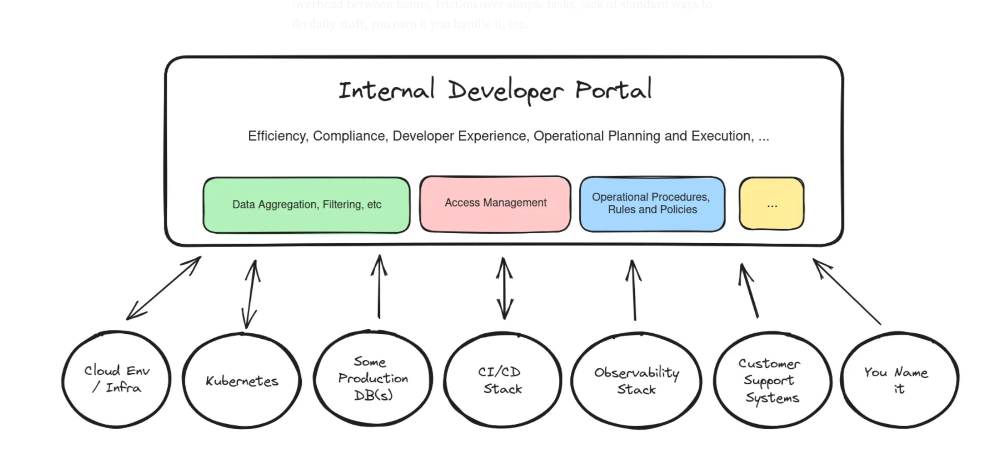

### So you’ve decided to build a platform instead of buying a headache

First, let’s agree: you can’t just buy an IDP without doing extra work. That thing your vendor calls “an all-in-one DevOps cloud-native microservice enablement synergy portal” is probably not going to scale. Real IDPs aren’t boxed products. They’re complex ecosystems you craft by integrating a handful of open source tools, some glue logic, a CI/CD pipeline, and a dash of organizational sanity.

Why build one yourself? Because enterprises need tailored environments. And because developers really don’t enjoy writing tickets asking for a staging environment and waiting two weeks. Your goal is to build self-service magic, not a monolith of despair.

So before you build your dream platform, take a breath. Look at what other teams have done. Get a feel for what their diagrams look like. Especially from the nice folks worked in IDP who’ve been there, done that, and open-sourced the scars.

---

### Start small. No smaller. Nope, smaller still. Build an MVP first

Repeat after me: “I do not need to solve everything at once.” This is the first commandment of IDP design. Most teams go big early, then collapse under the weight of their own ambitions. That’s why you need to build a Minimum Viable Platform (MVP).

Your MVP should include a representative app (a “Hello World” but with a job and responsibilities), some essential infra (a cluster, a database, a CI/CD pipeline), and just enough permissions to not scare security. It must be repeatable, boringly simple, and something you can demo without caveats.

Avoid fancy stuff like service meshes, custom portals, or advanced observability. You can add them later, once your developers have stopped laughing at your broken first try.

---

### Seriously. Use the architecture

Major tech giants lay out five “planes” of a good IDP, and no, it’s not an airline thing. Think of these like layers in a burrito. Each one has a role, and when done right, it’s delicious.

- **Developer Control Plane:** The bit developers see. Could be Backstage. Could be CLI. Could be a chatbot that gives them environments with sass.
- **Integration & Delivery Plane:** Where CI/CD lives, container images are born, and deployments happen.
- **Resource Plane:** Clusters, DBs, buckets. All the stuff your cloud bill is crying over.
- **Monitoring Plane:** Dashboards, logs, alerts that scream at midnight.
- **Security Plane:** Secrets, RBAC, and things that scare auditors.

No need to reinvent this. Google IDPs they will have templates ready. Use them to suit your needs. Then brag about it.

---

### The orchestrator is your platform’s brain (and therapist)

There’s a reason platform orchestrators are becoming the industry standard. You don’t want every dev team crafting YAML incantations from scratch. You want something in the middle that interprets what they ask for, matches it to your golden paths, and handles config generation dynamically.

If your IDP lacks this orchestration layer, it’s just a pile of tools duct-taped together. The orchestrator ensures standardization by design and keeps Ops from having to play whack-a-mole with inconsistent deployments. Bonus: it can reduce your config file sprawl by up to 95%. No, that’s not a typo.

---

### Use code-based abstractions like Score. Developers will thank you (eventually)

Some abstraction is good. Too much and you end up hiding everything useful. The trick is to let developers declare intent—“I need a database, not _this_ Postgres instance with _those_ flags.”

This is where something like Score comes in. It lets devs stay in Git, define their app dependencies declaratively, and trust that the platform will fill in the blanks. It’s the balance between freedom and standardization—like choose-your-own-adventure with guardrails.

---

### Final thoughts from someone who’s stepped on this rake before

You want to help developers ship faster. You want less ticket ops. You want fewer config headaches. But to get there, you have to design like a product team, not a tool junkie. Think in feedback loops, start with something small, and aim for boring consistency over ambitious chaos.

The MVP is not your end goal. It’s your launchpad. Once it proves value (and trust me, it will), then you scale. Just don’t try to build your own Kubernetes in the process. We’ve all seen how that ends, unless you really know what you are doing.
