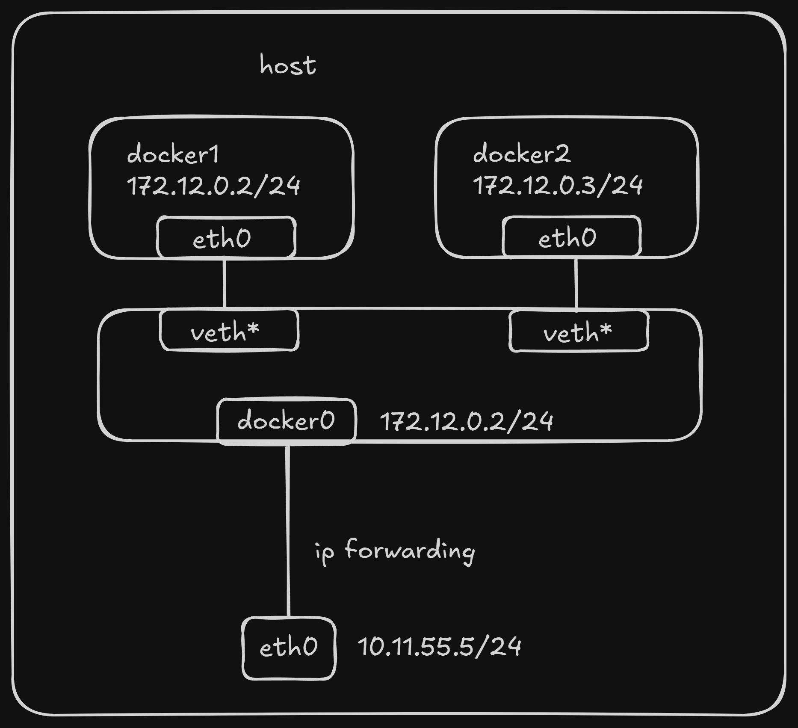
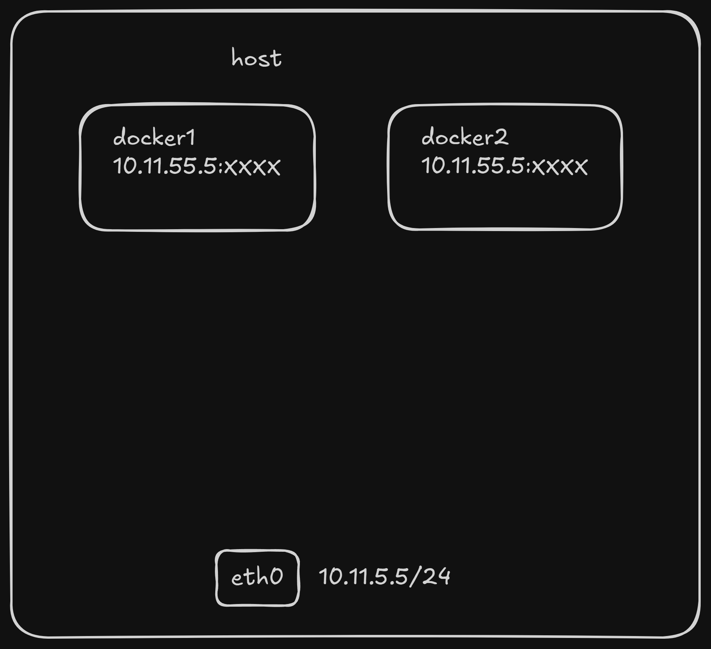
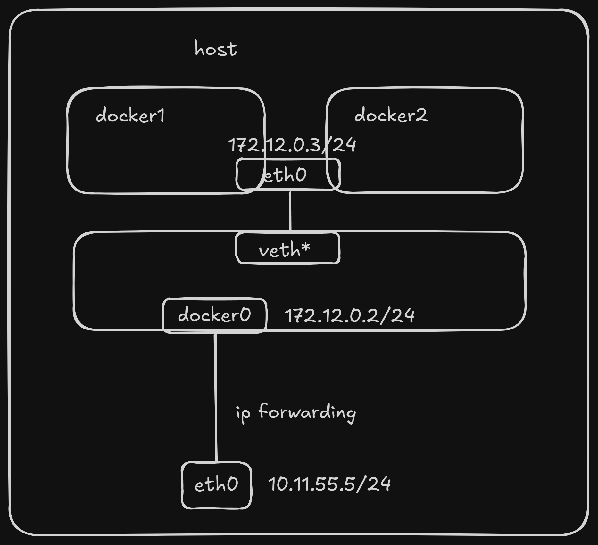

## Understanding Docker Network Modes

Docker provides several network modes that determine how containers connect to the host machine and to each other. Understanding these modes is crucial for designing robust and efficient containerized applications.

### 1. Bridge Mode (Default)

The Bridge network mode is the default and most commonly used networking option for Docker containers.

How it Works:

When the Docker daemon starts, it creates a virtual bridge named `docker0` on the host machine. All Docker containers launched on this host by default connect to this virtual bridge. This virtual bridge functions similarly to a physical network switch, connecting all containers on the host machine into a Layer 2 network.

- Each new container is assigned an IP address from the `docker0` subnet.
- The `docker0` bridge's IP address is set as the default gateway for the containers.
- Docker creates a pair of virtual Ethernet devices called `veth pair`. One end of the `veth pair` (named `eth0`) is placed inside the new container, acting as the container's network interface. The other end, typically named `vethxxxx` (e.g., `vethabc123`), remains on the host and is attached to the `docker0` bridge.

This setup allows containers to communicate with each other on the same host and with the outside world (via NAT).

Port Publishing (-p / --publish):

When you use `docker run -p <host_port>:<container_port> (or --publish)`, Docker automatically configures Destination Network Address Translation (DNAT) rules in the host's iptables. These rules forward incoming traffic from the specified host port to the corresponding port on the container, making the container's service accessible from outside the host. You can inspect these rules using `sudo iptables -t nat -vnL`.

Visual Representation:


**Demonstration:**

1. Run Containers in Default Bridge Mode:

   By default, if you don't specify the `--network` parameter, Docker uses the bridge network mode. We'll use a basic alpine image for these examples, which is small and common.

   ```bash
   docker run -d --name docker_bri1 alpine sleep 3600
   docker run -d --name docker_bri2 alpine sleep 3600
   ```

   - `docker run -d`: Runs the container in detached mode (in the background).
   - `--name`: Assigns a readable name to the container.
   - `alpine`: The Docker image to use.
   - `sleep 3600`: Keeps the container running for 1 hour.

2. Inspect the docker0 Bridge (on the host):

   You can view the docker0 bridge and connected veth interfaces using Linux network tools.

   ```bash
   # You might need to install bridge-utils and net-tools if not already present
   # For Debian/Ubuntu: sudo apt-get update && sudo apt-get install bridge-utils net-tools
   # For CentOS/RHEL: sudo yum install bridge-utils net-tools

   sudo brctl show
   ```

   This command shows the `docker0` bridge and the `veth` interfaces (e.g., `vethxxxx`) that connect your containers to it.

3. Inspect Container Network Configuration:

   Access one of the containers and check its network settings.

   ```bash
   docker exec -it docker_bri1 sh
   ```

   Inside the `docker_bri1` container, execute:

   ```bash
   / ip a
   / ip r
   ```

   - `ip a`: Shows network interfaces and assigned IP addresses (e.g., `eth0`).
   - `ip r`: Displays the routing table, showing `docker0`'s IP as the default gateway.

   Type `exit` to leave the container's shell.

**Custom Bridge Networks (Recommended for Multi-Container Communication):**

While the default `bridge` network allows containers on the same host to communicate by their IP addresses, using **custom bridge networks** is the highly recommended approach for inter-container communication. Custom networks provide better isolation, automatic DNS resolution for container names, and easier management compared to the legacy `--link` parameter.

**Demonstration with Custom Bridge Network:**

1. Create a New Custom Docker Network:

   This creates a new, isolated bridge network.

   ```bash
   docker network create -d bridge my-net
   ```

   - `-d bridge`: Specifies the network driver as `bridge`. Other drivers like `overlay` (for Docker Swarm) exist, but `bridge` is for single-host setups.

2. **Run Containers and Connect to the New `my-net` Network:**

   ```bash
   docker run -it --rm --name busybox1 --network my-net busybox sh
   ```

   - `--rm`: Automatically removes the container when it exits.
   - `busybox`: A very small image useful for testing.

   Open a **new terminal** and run another container, connecting it to the _same_ `my-net` network:

   ```bash
   docker run -it --rm --name busybox2 --network my-net busybox sh
   ```

3. Verify Container Connection:

   In a third terminal, list your running containers:

   ```bash
   docker container ls
   ```

   You should see `busybox1` and `busybox2` listed.

4. Test Inter-Container Communication (DNS Resolution):

   Go back to the terminal where busybox1 is running and ping busybox2 by its container name:

   ```bash
   / # ping busybox2
   PING busybox2 (172.19.0.3): 56 data bytes
   64 bytes from 172.19.0.3: seq=0 ttl=64 time=0.072 ms
   64 bytes from 172.19.0.3: seq=1 ttl=64 time=0.118 ms
   ^C # Press Ctrl+C to stop
   ```

   As you can see, `busybox2` is resolved to its IP address (e.g., `172.19.0.3`), and the `ping` is successful. This demonstrates that containers within the same custom network can communicate directly using their service names, thanks to Docker's built-in DNS service.

   Similarly, from the `busybox2` container, you can `ping busybox1`:

   ```bash
   / # ping busybox1
   PING busybox1 (172.19.0.2): 56 data bytes
   64 bytes from 172.19.0.2: seq=0 ttl=64 time=0.064 ms
   64 bytes from 172.19.0.2: seq=1 ttl=64 time=0.143 ms
   ^C # Press Ctrl+C to stop
   ```

   This confirms successful communication between `busybox1` and `busybox2`.

**For multiple interconnected containers, Docker Compose is highly recommended.** Docker Compose allows you to define and run multi-container Docker applications, simplifying networking, volume management, and service orchestration.

### 2. Host Mode

When a container is started with the `host` network mode, it does not get its own isolated Network Namespace. Instead, it shares the host machine's Network Namespace. This means:

- The container will not have its own virtual network interfaces or unique IP address.
- It will directly use the host's IP address and port space. If a service inside the container listens on port 80, it will be accessible on the host's IP address at port 80, provided no other process on the host is already using that port.
- However, other aspects of the container, such as its filesystem, process list, and user namespace, remain isolated from the host.

Use Cases:

Host mode is useful for performance-critical applications or when you need the container to directly access network services on the host without any network address translation (NAT) overhead, such as when running a network monitoring tool or a high-performance proxy.

Visual Representation:



**Demonstration:**

1. **Run Containers in Host Mode:**

   ```bash
   docker run -d --network host --name docker_host1 alpine sleep 3600
   docker run -d --network host --name docker_host2 alpine sleep 3600
   ```

   _Note: Running multiple containers in host mode that try to bind to the same port will result in port conflicts._

2. **Inspect Container Network Configuration (inside the container):**

   ```bash
   docker exec -it docker_host1 sh
   ```

   Inside the `docker_host1` container, execute:

   ```bash
   / ip a
   / ip r
   ```

   You will observe that the IP addresses and network interfaces listed are the same as those on the host machine, demonstrating that the container is sharing the host's network stack.

   Type `exit` to leave the container's shell.

### 3. Container Mode (or `container:NAME_OR_ID`)

This mode specifies that a newly created container should share the Network Namespace of an already existing container, rather than sharing with the host.

- The new container will not create its own network interfaces or configure its own IP address.
- It will share the IP address, port range, and network configuration (e.g., DNS servers, routing table) of the specified existing container.
- The two containers, while sharing network resources, still maintain isolation in other aspects like their filesystem, process list, and user namespace.
- Processes in both containers can communicate with each other via the loopback interface (`lo`).

Use Cases:

This mode is commonly used in "sidecar" patterns, where a helper container shares the network stack with a primary application container. For example, an Nginx reverse proxy might share the network namespace with a web application container to simplify configuration and inter-process communication.

Visual Representation:



**Demonstration:**

1. Start a "Base" Container (e.g., in bridge mode):

   First, we need a container whose network stack will be shared.

   ```bash
   docker run -d --name docker_bri1 alpine sleep 3600
   ```

2. **Start a New Container in `container` Mode, Sharing `docker_bri1`'s Network:**

   ```bash
   docker run -d --network container:docker_bri1 --name docker_con1 alpine sleep 3600
   ```

3. **Inspect Network Configuration of Both Containers:**

   ```bash
   docker exec -it docker_con1 sh
   ```

   Inside `docker_con1`, execute `ip a` and `ip r`. Note the IP address.

   ```bash
   / ip a
   / ip r
   ```

   Type `exit`. Now, do the same for `docker_bri1`:

   ```bash
   docker exec -it docker_bri1 sh
   ```

   Inside `docker_bri1`, execute `ip a` and `ip r`.

   ```bash
   / ip a
   / ip r
   ```

   You will observe that `docker_con1` and `docker_bri1` have the exact same IP addresses and network interfaces, confirming they share the same network stack.

   Type `exit` to leave the container's shell.

### 4. None Mode

In `none` network mode, a Docker container has its own isolated Network Namespace, but Docker does not configure any network interfaces within it. This means:

- The container will have no network card, no IP address, and no routing information.
- It is completely isolated from the network, both external and internal.
- You would need to manually add network interfaces and configure IP addresses and routes within the container if you wanted it to have network connectivity.

Use Cases:

This mode is typically used for specialized containers that do not require any network access, or when you need full control over the container's networking configuration and plan to set it up manually using other tools. It's often used for security-critical environments where network isolation is paramount.

Visual Representation:

(Container is isolated and has no network connectivity by default.)

**Demonstration:**

1. **Run a Container in None Mode:**

   ```bash
   docker run -d --network none --name docker_non1 alpine sleep 3600
   ```

2. **Inspect Network Configuration (inside the container):**

   ```bash
   docker exec -it docker_non1 sh
   ```

   Inside the `docker_non1` container, execute:

   ```bash
   / ip a
   / ip r
   ```

   You will see only the loopback interface (`lo`) and no other network interfaces or routing entries, confirming the lack of network configuration.

   Type `exit` to leave the container's shell.

---

### Further Topics: Cross-Host Communication

This guide focuses on single-host Docker networking. For Docker containers to communicate across different host machines, you would typically use advanced networking solutions like:

- **Overlay Networks (Docker Swarm Mode):** Built-in Docker Swarm capability that enables communication between containers running on different nodes in a Swarm cluster.
- **Third-Party Container Network Interface (CNI) Plugins:** Solutions like Calico, Flannel, or Weave Net provide more sophisticated networking capabilities, often used in larger container orchestration platforms like Kubernetes.

These topics, especially cross-host communication, are more advanced and are often covered in the context of container orchestration platforms like Kubernetes.
