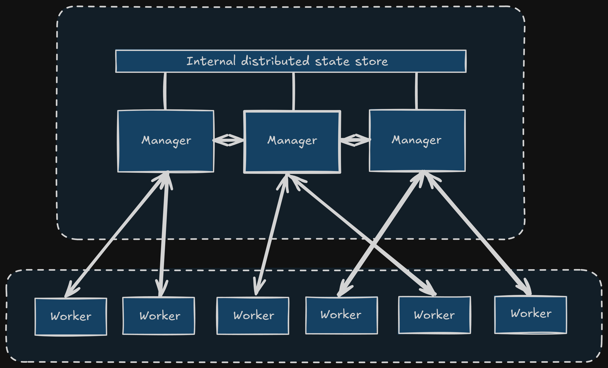
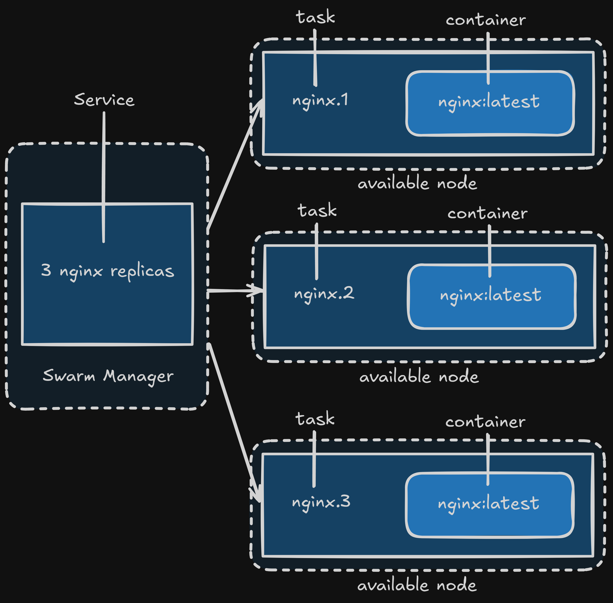

Docker Swarm, powered by SwarmKit, is Docker Engine's native clustering and orchestration solution. As one of Docker's core projects, it's central to providing container cluster services and supporting the broader Docker ecosystem.

Docker Swarm allows you to transform multiple Docker hosts into a single, large virtual Docker host, enabling the rapid creation of a container cloud platform. Swarm mode includes built-in key-value storage and offers a host of powerful features such as fault-tolerant decentralized design, integrated service discovery, load balancing, routing mesh, dynamic scaling, rolling updates, and secure transport. These capabilities allow native Docker Swarm clusters to effectively compete with orchestrators like Kubernetes.

Before diving into Docker Swarm, let's understand some fundamental concepts.

## Core Concepts

### Nodes

Any Docker-enabled host can either initialize a new Swarm cluster or join an existing one, thereby becoming a **node** within that Swarm. Nodes are categorized into two types: **manager nodes** and **worker nodes**.

- **Manager Nodes**: These nodes are responsible for managing the Swarm cluster. Most `docker swarm` commands can only be executed on manager nodes (the `docker swarm leave` command is an exception and can be run on worker nodes). A Swarm cluster can have multiple manager nodes, but only one is elected as the **leader** using the Raft consensus protocol. The leader is responsible for making all scheduling decisions and maintaining the desired state of the cluster.
- **Worker Nodes**: These are the execution nodes for tasks. Manager nodes dispatch **services** to worker nodes for execution. By default, manager nodes also act as worker nodes, meaning they can run tasks. However, you can configure services to run exclusively on worker nodes or even specific manager nodes.



### Services and Tasks

- **Task**: In Swarm, a **task** is the smallest schedulable unit, essentially representing a single running container.
- **Service**: A **service** is a collection of tasks that define the properties and behavior of your applications within the Swarm. Services come in two primary modes:
  - **Replicated Services**: These services run a specified number of identical tasks across various worker nodes, distributing the workload.
  - **Global Services**: These services run exactly one task on _every_ available worker node in the Swarm, suitable for agents or monitoring tools that need to be present on all nodes.

You specify the service mode using the `--mode` parameter with the `docker service create` command.



## Setting Up a Docker Swarm Cluster

For this guide, we'll use `docker-machine` to simulate our Swarm hosts. While `docker-machine` is less commonly used for production Swarm deployments today (as most setups involve cloud VMs or bare metal servers directly), it's excellent for demonstration and learning.

### Initialize the Manager Node

First, let's create our manager node and initialize the Swarm cluster on it.

```bash
# Create a virtual machine for the manager
docker-machine create -d virtualbox manager

# Configure your shell to connect to the manager's Docker daemon
eval $(docker-machine env manager)

# SSH into the manager node and initialize the Swarm
# Replace 192.168.99.101 with the IP address of your manager machine.
# You can find this IP by running `docker-machine ip manager`.
docker-machine ssh manager 'docker swarm init --advertise-addr $(docker-machine ip manager)'
```

The `docker swarm init` command automatically makes the node where it's executed a manager node. The output will provide a `docker swarm join` command for adding worker nodes. **Copy this command, as you'll need it for the worker nodes.**

**Note:** Always use the actual IP address of the manager node for `--advertise-addr`. This ensures other nodes can correctly connect to the manager.

### Add Worker Nodes

After initializing the manager, create additional `docker-machine` instances to act as worker nodes and join them to the Swarm.

```bash
# Create a virtual machine for worker1
docker-machine create -d virtualbox worker1

# Configure your shell to connect to worker1's Docker daemon
eval $(docker-machine env worker1)

# SSH into worker1 and join the swarm using the command from the manager's initialization output
# Replace the token and IP with the actual values from your manager's output.
docker-machine ssh worker1 'docker swarm join --token SWMTKN-1-xxxxxxxxxxxxxxxxxxxxxxxxxxxxxxxxxxxxxxxxxxxxxxxxxxxxxxxxxxxx 192.168.99.101:2377'

# Repeat for worker2
docker-machine create -d virtualbox worker2
eval $(docker-machine env worker2)
docker-machine ssh worker2 'docker swarm join --token SWMTKN-1-xxxxxxxxxxxxxxxxxxxxxxxxxxxxxxxxxxxxxxxxxxxxxxxxxxxxxxxxxxxx 192.168.99.101:2377'
```

You'll see a message like "This node joined a swarm as a worker." confirming the successful addition.

## Inspecting the Swarm Cluster

Now that we have a basic Swarm cluster (one manager, two workers), let's inspect its status.

**Ensure your shell is connected to the manager node:**

```bash
eval $(docker-machine env manager)
```

### View Swarm Nodes

To see all nodes in your Swarm and their status:

```bash
docker node ls
```

You should see an output similar to this (Engine Version will be much newer):

```bash
ID                            HOSTNAME            STATUS              AVAILABILITY        MANAGER STATUS      ENGINE VERSION
<manager-id> * manager             Ready               Active              Leader              26.1.4
<worker1-id>                  worker1             Ready               Active                                  26.1.4
<worker2-id>                  worker2             Ready               Active                                  26.1.4
```

- The `*` next to the manager ID indicates it's the current node you're connected to.
- `Ready` status means the node is healthy and part of the Swarm.
- `Active` availability means the node is available for task scheduling.
- `Leader` indicates the current manager leader.

### Deploying a Service

Let's deploy a simple Nginx service to our Swarm. We'll use a recent and stable Nginx image.

```bash
docker service create --replicas 3 -p 80:80 --name nginx nginx:stable-alpine
```

- `--replicas 3`: This tells Swarm to maintain 3 instances of the Nginx container. Swarm will distribute these across your available worker (and manager, by default) nodes.
- `-p 80:80`: Publishes port 80 of the service to port 80 on any node running a task for this service. Swarm's routing mesh handles load balancing requests across the service's tasks.
- `--name nginx`: Assigns the name "nginx" to our service.
- `nginx:stable-alpine`: Specifies the Docker image to use for the service. `stable-alpine` is a good choice for production due to its small size and stability.

You'll see progress as Swarm deploys the tasks.

### View Services

To list all services running in your Swarm:

```bash
docker service ls
```

Output:

```bash
ID                  NAME                MODE                REPLICAS            IMAGE                 PORTS
<service-id>        nginx               replicated          3/3                 nginx:stable-alpine   *:80->80/tcp
```

The `3/3` under `REPLICAS` indicates that 3 desired tasks are running out of 3.

### View Service Tasks

To see which nodes are running the tasks for a specific service:

```bash
docker service ps nginx
```

Output:

```bash
ID                  NAME                IMAGE                 NODE                DESIRED STATE       CURRENT STATE           ERROR               PORTS
<task-id-1>         nginx.1             nginx:stable-alpine   worker1             Running             Running X minutes ago
<task-id-2>         nginx.2             nginx:stable-alpine   worker2             Running             Running X minutes ago
<task-id-3>         nginx.3             nginx:stable-alpine   manager             Running             Running X minutes ago
```

This shows which node each task of the `nginx` service is running on.

### Accessing Service Logs

To view the aggregated logs for all tasks belonging to a service:

```bash
docker service logs nginx
```

### Removing a Service

To remove a service from the Swarm:

```bash
docker service rm nginx
```

This will stop and remove all tasks associated with the `nginx` service.

## Deploying Multiple Services with Docker Stack

Just as you use `docker-compose.yml` to define and manage multiple interdependent containers, in Docker Swarm, you use a Compose file (often named `docker-compose.yml` or a more specific `stack.yml`) with `docker stack` commands to deploy multiple interconnected services. This allows you to deploy entire applications as a single unit.

Let's illustrate by deploying a WordPress application, which typically involves both a WordPress service and a database service.

Create a file named `docker-compose.yml` (or `stack.yml`) with the following content:

```yaml
version: "3.9" # Use the latest Compose file format for Swarm compatibility

services:
  wordpress:
    image: wordpress:latest # Use latest for demonstration, consider a specific version for production
    ports:
      - "80:80"
    networks:
      - overlay
    environment:
      WORDPRESS_DB_HOST: db:3306
      WORDPRESS_DB_USER: wordpress
      WORDPRESS_DB_PASSWORD: wordpress_password # Use a strong, unique password in production
    deploy:
      mode: replicated
      replicas: 3
      restart_policy: # Best practice: Define restart policies for robustness
        condition: on_failure
      update_config: # Best practice: Control rolling updates
        parallelism: 1
        delay: 10s
        failure_action: rollback
        order: start-first

  db:
    image: mysql:8.0 # Use a recent stable MySQL version
    networks:
      - overlay
    volumes:
      - db-data:/var/lib/mysql # Persist database data
    environment:
      MYSQL_ROOT_PASSWORD: secure_root_password # Change this to a strong password!
      MYSQL_DATABASE: wordpress
      MYSQL_USER: wordpress
      MYSQL_PASSWORD: wordpress_password # Must match the wordpress service's password
    deploy:
      placement:
        constraints: [node.role == manager] # Pin DB to manager for simplicity, but consider dedicated storage for production
      restart_policy:
        condition: on_failure
    # Best practice: Don't expose database ports directly to the outside unless absolutely necessary.
    # It's better to access it internally by other services in the overlay network.

  visualizer:
    image: dockersamples/visualizer:latest # Use latest for demonstration
    ports:
      - "8080:8080"
    volumes:
      - "/var/run/docker.sock:/var/run/docker.sock" # Allows Visualizer to read Docker events
    deploy:
      placement:
        constraints: [node.role == manager] # Pin Visualizer to manager
      restart_policy:
        condition: on_failure

volumes:
  db-data: # Define the named volume for database persistence

networks:
  overlay: # Define the overlay network for inter-service communication
    driver: overlay
    attachable: true # Allows standalone containers to join if needed
```

**Key Enhancements and Best Practices:**

- **`version: '3.9'`**: Using the latest Compose file format (3.9) ensures compatibility with the latest Docker Swarm features.
- **Specific Image Versions**: While `latest` is used for demonstration, in production, always pin to a specific, immutable image version (e.g., `wordpress:6.5.4-php8.2-apache`, `mysql:8.0.37`). This prevents unexpected breaking changes.
- **Strong Passwords**: Emphasize using strong, unique passwords for production deployments.
- **`restart_policy`**: Crucial for service resilience. `on_failure` ensures a task is restarted if it exits with a non-zero status.
- **`update_config`**: Essential for controlled rolling updates.
  - `parallelism`: How many tasks to update at once. `1` is safest.
  - `delay`: Pause between updating tasks.
  - `failure_action`: What to do if an update fails (`rollback` or `continue`).
  - `order`: Whether to `start-first` (new task before stopping old) or `stop-first`. `start-first` provides better uptime during updates.
- **Named Volumes (`db-data`)**: Used for persistent storage of database data. This is critical to prevent data loss if the database container is restarted or moved.
- **Overlay Networks**:
  - `driver: overlay`: The standard network driver for Swarm services, enabling communication across nodes.
  - `attachable: true`: Allows standalone containers (not part of a service) to join this network, which can be useful for debugging.
- **`placement.constraints`**: Used to control where services are deployed.
  - `node.role == manager`: This pins the `db` and `visualizer` services to run only on manager nodes. While convenient for this example, for a highly available database in production, you'd typically use dedicated storage solutions (e.g., cloud block storage, shared file systems, or a database cluster) rather than pinning to a single manager node. The Visualizer is fine on a manager.
- **No Exposed DB Ports**: By default, the `db` service doesn't expose any ports to the host (`ports:` section is omitted). This is a security best practice, as the `wordpress` service can communicate with `db` directly over the `overlay` network using its service name (`db`).
- **Docker Samples Visualizer**: The `visualizer` service provides a web-based interface (accessible on port 8080 of a manager node) to visualize your Swarm cluster's services and their placement.

Save this `docker-compose.yml` file on your **manager node**.

### Deploying the Stack

To deploy the services defined in your `docker-compose.yml` file as a stack:

```bash
docker stack deploy -c docker-compose.yml wordpress
```

- `docker stack deploy`: The command for deploying multi-service applications on Swarm.
- `-c docker-compose.yml`: Specifies the Compose file to use.
- `wordpress`: This is the **stack name**. All services defined in the Compose file will be prefixed with this name (e.g., `wordpress_wordpress`, `wordpress_db`, `wordpress_visualizer`).

### Viewing Stacks

To list all deployed stacks in your Swarm:

```bash
docker stack ls
```

Output:

```bash
NAME                SERVICES
wordpress           3
```

### Removing a Stack

To remove all services and networks associated with a stack:

```bash
docker stack rm wordpress
```

Output:

```bash
Removing service wordpress_db
Removing service wordpress_visualizer
Removing service wordpress_wordpress
Removing network wordpress_overlay
Removing network wordpress_default
```

**Important Note on Data Volumes**: The `docker stack rm` command **does not remove** any data volumes created by the services in the stack (e.g., `db-data`). If you wish to remove these volumes, you must do so explicitly using `docker volume rm`:

```bash
docker volume ls # To list all volumes
docker volume rm wordpress_db-data # Assuming the volume was named wordpress_db-data by the stack
```
